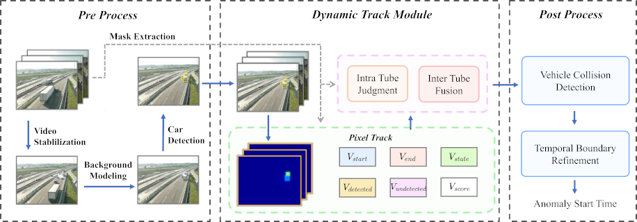

# NVIDIA AICITY CHALLENGE 2021 - Track 4

## Good Practices and A Strong Baseline for Traffic Anomaly Detection

This repository contains a customized source code of Track 4 in the NVIDIA AI City Challenge at CVPR 2021.

### Introduction

The Track 4 of NVIDIA AI CITY 2021 comprised of detecting anomalies based on different video feeds available from multiple cameras at intersections and along highways. 

The paper of this code can be found in [arxiv](https://arxiv.org/abs/2105.03827)

Detailed information of NVIDIA AICity Challenge 2021 can be found [here](https://www.aicitychallenge.org/).

Overview of the architecture of our anomaly detection framework, which consists of three main pipelines.

### Pipeline

### Requirements

1. Python 3.7
2. To run the model from scratch, please request data from the organizers.
3. [PaddleDetection](https://github.com/PaddlePaddle/PaddleDetection)
4. Run `python install_decord.py`.

To run model from scratch, please follow these steps:

-- Pre Processing
1. Run `python pre_processing/stabilize_video.py` to apply DVS. 
2. Run `python pre_processing/model_background.py` to segment the processed frames.
3. Run `python pre_processing/detect_vehicle.py` for two-stream vehicle detection.
4. Run `python pre_processing/generate_mask.py` to produce trajectory-based masks.

-- Dynamic Track
1. Run `python dynamic_track/pixel-level_tracking.py` to filter out suspicious events.
2. Run `python dynamic_track/intra-tube_judgement.py` to remove the parts that do not belong to current anomalous
vehicles.
3. Run `python dynamic_track/inter-tube_fusion.py` to fuse candidate tubes which represent to the
same vehicle.

-- Post Processing
1. Run `python post_processing/detect_vehicle_collision.py` to detect vehicle collisions.
2. Run `python post_processing/refine_temporal_boundary.py` to obtain a more accurate temporal localization.